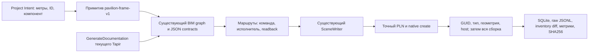

# Archicad Project Accelerator MVP — 09.10.2026

Результат: собран один последовательный контур для целого тестового каркаса
павильона. Реальный preflight — `READY_FOR_EXPLICIT_TEST_RUN`. Создание павильона
в Archicad — **NOT RUN**: в этом проходе `--execute` не включался.

## Инвентарь и доказательства

Статусы различают текущую машину, сохранённые прежние испытания, наличие кода
и исследовательских кандидатов. Схема/API не считается доказательством записи.

| Решение | Подтверждение | Решение для MVP |
|---|---|---|
| Archicad 29 | Новый `API.GetProductInfo`: version 29, build 5101, RUS | Текущий хост; patch-level 29.2.1 также указан в `docs/ARCHICAD_RUNTIME_CURRENT.md` по прежнему UI evidence |
| Модифицированный Tapir | Новый `GetAddOnVersion`: 1.5.10; `GenerateDocumentation` экспортировал 262 команды и 361 общую схему; GUID до/после совпали | Основной локальный транспорт на 19723; stock 1.5.8 не используется ускорителем |
| BIM-graph | `scripts/archicad_bim_graph.py`, контракты, сортировка зависимостей, ссылки `$createdGuid`, проверки размещения проёмов из уже подготовленного кода | Используется непосредственно; новая реализация DAG не написана |
| Whole-scene runner | `archicad_scene_v1.py`, `archicad_scene_run.py`; исправление локального пути и связи схемы с хэшем из 9 октября | Используется непосредственно; пять типов native create, 12 элементов. Живая запись сцены ещё не доказана |
| Wall/Mailbox | `scripts/archicad_mailbox_wall_host.py`, `archicad_mailbox_graph_adapter.py` и прежний runtime dry-run в документации | Сохранены. Mailbox ограничен Wall; не расширен до произвольных команд; watcher не менялся |
| Native API / Model Dump v1 | Исходники и прежний локальный `outputs/model-dump-v1/verification.json`: `MVP PASS`, 5296 элементов, 9261 тел, 340188 вершин, 242264 граней. Это другой проход/проект/сборка | **HISTORICAL_LIVE**, не текущий dump. `GetModelDumpV1` отсутствует в свежем экспорте загруженного Tapir; подключение к текущему экземпляру **NOT_VERIFIED**. APX не устанавливался |
| MEP Designer/native API | Исследования checkpoint 25/29/30/39/40; в текущем экспорте 11 команд с MEP в имени, включая CreateMEPRoutingElements | **SCHEMA_ONLY / UNSUPPORTED**. Лицензия, успешная native-трасса, порты, расчётный граф не подтверждены. Сверочный чат сообщает о неудачной попытке; независимого сырого результата этой попытки здесь нет |
| Локальный MCP | На машине найдены `archicad-mcp-server 0.6.0`, `archicad 29.3000`, `multiconn-archicad 0.8.4`, `mcp 1.30.0`, `jsonschema 4.26.0` | **INSTALLED_PACKAGE**, не доказательство активной MCP-сессии. Для первой связки используется тот же прямой локальный Tapir, без нового сервера |
| Нормативная база | В репозитории есть provider/source matrices и rule matrix; отдельно найдены `ProjectNormativeBundle`, `ConstraintCompilation`, `FunctionalProgram`, `planning_engine.py` в сохранённой разработке от 5 октября и ветках `work/*` | **CODE / HISTORICAL_OFFLINE**. Не подмешиваются как безусловные нормы павильона. Следующий этаж должен получать применимые, подтверждённые требования, а не глобальную библиотеку напрямую |
| Типовые узлы | `details/ACTIVE_RELEASE`, пакет v2.12 и его summary/audit: 1215 узлов/IR, 1835 фактов, 601 вариант, 532 задачи, 5 противоречий между листами | **LOCAL_ARTIFACT**, числа прочитаны из сохранённого summary, полный аудит пакета здесь не повторялся. Узлы не допущены к произвольной записи/строительству; `commit_allowed_true_introduced=0` |
| Шаблон | Реестры в `docs/archicad-template`, `scripts/archicad_template_builder.py`, PRE-LIVE/BUILDER checkpoint | **CODE / SAVED_OFFLINE_CI**. Текущий PLN не перестраивался, реальные атрибуты/виды/листы этим проходом не приняты |
| NetworkX / OR-Tools | Исследовательские предложения; существующий прямоугольный planner v0 найден локально | **CANDIDATE** для помещения/этажа; не нужны для уже работающего DAG павильона. Не заявляем запущенный solver |
| IfcOpenShell / IfcTester / IfcClash / BCF | Исследования openBIM и checkpoint 40 | **RESEARCH_CANDIDATE**: локальный импорт/расчёт/IFC round-trip этим проходом не подтверждены |
| OpenMEP / EPANET / SWMM / Modelica / Radiance | Исследования checkpoint 39/40 | **RESEARCH_CANDIDATE**: точность, установка и адаптация к российским требованиям не приняты. Наличие исходников не равно готовому инженерному расчёту |
| HuskyBIM / официальный Graphisoft MCP / CYPE / CALHYDRA / MagiCAD | Сравнительные исследования checkpoint 13/15/39/40 | **REFERENCE_ONLY**. Текущая доступность отдельно не проверялась. Платные иностранные/cloud зависимости не входят в обязательный локальный контур |

Доказательства прежнего preflight от 9 октября сохранены в соседнем чате
`2026-10-09/referenced-chatgpt-conversation-this-is-an-2/outputs/scene-launch-fix`:
38/38 selected offline, scan 22, 0 записей, 0 сохранений. Новые результаты ниже
относятся только к ускорителю этого прохода, не заменяют исторические файлы.

## Архитектура минимального конструктора



Единый вход: `scripts/archicad_project_accelerator.py`. Источник намерения:
`examples/accelerator/pavilion.intent.json`. Пользователь выбирает компонент,
а не составляет вручную двенадцать несвязанных команд. Все размеры, координаты,
метрики и host-ссылки получаются из одного существующего примитива.

Первый компонент — **каркас павильона**, наружный габарит 4×3×3 м:
4 стены, 1 перекрытие, 4 колонны, 2 окна, 1 дверь. Крыши, зон, отделки,
конструктивного расчёта, MEP и выпуска документации в нём нет. Он не обозначается
готовым проектом здания. Проектные метрики — footprint 12 м², условный наружный
объём 36 м³ и внутренняя площадь до вычета колонн 9.36 м²; это метрики намерения,
а не фактическая смета или нормативная экспертиза.

Расширение выполняется последовательно: новый примитив компилирует операции
в тот же граф, регистрирует проверенные маршруты/проверки чтением и сохраняет
доказательства. Пока таких маршрутов нет, обязательные `typical-floor-v1` и
`mep-network-v1` возвращают `UNSUPPORTED_PRIMITIVE` до вызовов Archicad.
Неизвестные поля намерения отклоняются, а не молча игнорируются.

## Границы исполнения

- По умолчанию — offline; `--preflight` разрешает только чтение.
- Отдельный `--refresh-schema` вызывает GenerateDocumentation: только два JS-файла в новой папке, без изменения модели. Парсер не выполняет JavaScript.
- Для схемы проверяются origin, версия 1.5.10, SHA256 исходных JS и полное равенство JSON разобранному экспорту. Метаданные сами по себе не дают доверия изменённым контрактам.
- Точный saved local PLN: `C:\LocalAI\SafeBIM_Global_Library_Test_Projects\Тест MER .pln`; имя `Тест MER ` содержит завершающий пробел. Story index=0, floorId=1, level=0; Tapir 1.5.10, Archicad major=29.
- Первой живой операцией является проверка PLN. Неправильная идентичность останавливает проход до инвентаря/дальнейших действий. Проект не переключается.
- Запись требует `--execute`, уникальный `--run-id`, совпадающий `--confirm-plan-hash`, стабильную существующую папку `--data-dir`. Хэш связывает намерение, граф/схему, маршруты и проект.
- SceneWriter повторяет preflight, проверяет проект на границе каждой записи, сохраняет точное намерение и локальную область допуска в SQLite **до** native call.
- Созданный Wall GUID читается и проверяется до использования в Window/Door. Каждый созданный элемент проверяется чтением; затем ускоритель повторно проверяет все 12 элементов после сборки.
- Финальный inventory diff должен содержать ровно возвращённые 12 GUID и никаких удалений. Совпадение проверяется отдельно от локальных step PASS.
- Ошибка/таймаут останавливает проход. Неопределённый результат — `PARTIAL_OR_UNKNOWN_OUTCOME`; автоматического повтора, удаления, отката, сохранения или публикации нет. Исходный SceneWriter запрещает повтор scene ID/plan hash в постоянном журнале.
- Каталог доказательств каждого прохода новый; ledger постоянный. Замена/удаление ledger не является допустимым способом повтора. Финальная ошибка сборки отражена в aggregate `result.json`, даже если исходный журнал отдельных шагов уже содержит PASS.

## Критерии готовности и текущий результат

| Критерий | Итог |
|---|---|
| Целое намерение → 12 связанных операций → граф → маршруты → артефакты | **ГОТОВО / OFFLINE** |
| Полная цепочка исполнения, host GUID, финальный inventory diff, проверка всей сборки | **SYNTHETIC PASS**, не живая запись |
| Неверный PLN, неподдерживаемый MEP/этаж, изменённое намерение/схема | Останавливаются до записи; выбранные offline проверки PASS |
| Таймаут, повтор намерения, изменение после сборки | Остановка и долговечный запрет повтора; выбранные offline проверки PASS |
| Новый GenerateDocumentation текущего Add-On | **LIVE**, 262 команды, 361 общая схема, inventory unchanged |
| Новый единый preflight ускорителя | **LIVE READY_FOR_EXPLICIT_TEST_RUN**, Archicad 29 build 5101, scan 22, GUID unchanged, modelWriteAttempts=0 |
| Выбранные проверки существующих контрактов/графа/Mailbox/сцены и нового ускорителя | **65/65 OFFLINE PASS**; это выбранный набор, не полный тест всего репозитория |
| Создание всех 12 элементов в Archicad, видимый результат | **NOT RUN**, ждёт явного `--execute`; визуальная приёмка тоже не выполнена |
| Типовой этаж | **UNSUPPORTED** до приёмки павильона и подключения существующего planner → native translator |
| MEP | **UNSUPPORTED** до отдельного доказательства native route/портов и лицензии либо явно обозначенного ненативного fallback |
| Скорость комплексного проектирования | **NOT_MEASURED**: baseline и повторный комплексный проект не сравнивались. 0.455 с — длительность одного read-only preflight, не доказательство ускорения проектирования |

Офлайн-тесты сначала наткнулись на недоступную sandbox TEMP-папку и SQLite.
После переноса TEMP/TMP в `work/test-tmp` выбранный набор прошёл; проверки не
ослаблялись. Первый сетевой вызов блокировался sandbox, затем разрешённое чтение
localhost выполнено вне этого ограничения. Модельные записи не запускались.

## Запуск

Требование окружения: Python 3.12 и `jsonschema>=4,<5`. Текущее установленное
окружение archicad-mcp-server уже содержит зависимость; новый сервер не нужен.

Из корня отдельной ветки:

```powershell
$python = 'C:\Users\Admin\AppData\Roaming\uv\tools\archicad-mcp-server\Scripts\python.exe'
& $python scripts/archicad_project_accelerator.py --intent examples/accelerator/pavilion.intent.json --output <new-offline-directory>
& $python scripts/archicad_project_accelerator.py --refresh-schema --output <new-schema-directory>
& $python scripts/archicad_project_accelerator.py --intent examples/accelerator/pavilion.intent.json --schema <new-schema-directory>/tapir-scene-live.json --preflight --output <new-preflight-directory>
```

Только после явного решения создать этот каркас; использовать хэш из последнего
preflight с теми же intent/schema, новую папку доказательств и постоянный ledger:

```powershell
& $python scripts/archicad_project_accelerator.py --intent examples/accelerator/pavilion.intent.json --schema <new-schema-directory>/tapir-scene-live.json --execute --run-id <unique-pavilion-id> --confirm-plan-hash <preflight-hash> --data-dir <existing-stable-ledger-directory> --output <new-execute-directory>
```

Создание каталога доказательств не означает создание элементов. `COMPLETE_UNSAVED`
допустим только с `wholeAssemblyReadback=true` и `evidenceKind=LIVE`. Подставной
транспорт обозначается `SYNTHETIC`; offline план обозначается `OFFLINE`.

## Последовательное развитие

1. Этот каркас: явная живая запись → финальный readback → видимая приёмка → ГОТОВО.
2. Павильон: добавить крышу/Zone/атрибуты/проверенные узлы по мере нужды; повторить целостную приёмку. Не выдавать тестовый каркас за комплексный проект.
3. Типовой этаж: использовать существующие FunctionalProgram/ConstraintCompilation/planner v0, добавить один native переводчик помещений/стен/проёмов/этажей. Зафиксировать работающий этаж.
4. MEP: резервы шахт/пространства → одна native система с портами → один расчётный engine и независимый benchmark → следующий раздел. Нормативная пригодность отдельна от физики и геометрии.
5. После работающих сценариев измерять время brief→verified assembly, native-call count, повторные проверки, долю неподдержанных функций и трудозатраты. Оптимизировать фактическое узкое место; не менять текущий DAG на новый solver ради инфраструктуры.

Main, deployed watcher и рабочие PLN не изменялись. Локальная ветка создана от
`c0223e18370e5e3d5205ca401a68d7603b4be120` в отдельном worktree репозитория
`dvikt33-ux/safe-bim-layer`. GitHub push/PR этим проходом не выполнялись.
