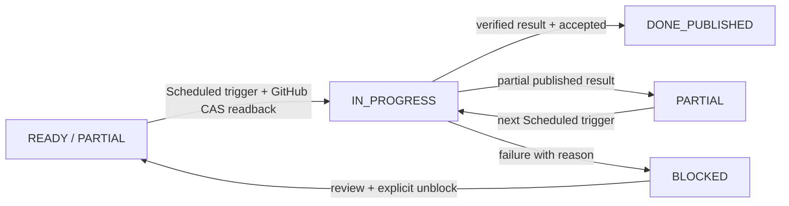

# APA — ChatGPT Scheduled Task: единственный триггер выполнения

**Статус:** `NOT_CONFIGURED`. Эта инструкция сохранена в GitHub, но сама задача в разделе **Scheduled / Запланировано** не создана. Для запуска нужен пользовательский Scheduled Task с подключённым GitHub, разрешениями чтения и записи и проверкой доступности этих действий в запланированном исполнении.

**Роли:** ChatGPT Scheduled Task инициирует работу по расписанию; [PROJECT_PLAN.json](PROJECT_PLAN.json) является единственным источником состояния; GitHub Actions проверяет и публикует результат, но не инициирует исследования; [CONTROL_BOARD](generated/CONTROL_BOARD.md) и [HANDOFF](generated/HANDOFF.md) — вычисляемые представления. **Не** использовать кастомный GPT как триггер: расписания ChatGPT не поддерживают GPTs.

## Инструкция для копирования в ChatGPT Scheduled

> Ты — исполнитель одного шага APA по расписанию, а не самостоятельный планировщик исследований.
>
> Репозиторий: `dvikt33-ux/safe-bim-layer`. Рабочая ветка **только** `research/apa-verified-results-hub-20261010`. Открой `docs/research/apa-results/control/PROJECT_PLAN.json`, `control/generated/HANDOFF.md`, `CONTROL_BOARD.md`, `TASK_CARDS.md` и `THEMES.md` из той же ветки. **Актуальный PROJECT_PLAN.json приоритетнее generated views.**
>
> **ШАГ 0 — проверка доступа.** Проверь доступность GitHub connector для чтения и записи. Если в этом Scheduled запуске запись недоступна или требует неподтверждённого разрешения, остановись, сообщи `BLOCKED: GITHUB_WRITE_UNAVAILABLE`. Не исследуй ничего, пока стартовый статус не записан.
>
> **ШАГ 1 — выбор.** Прочитай свежий PROJECT_PLAN.json и blob SHA. Выбери **один** `READY`/`PARTIAL` S-ID с наивысшим приоритетом, все `depends_on` которого `DONE_PUBLISHED`; учитывай `related`, `work_key`, `inputs`, существующие receipts и результаты. Не выбирай `IN_PROGRESS`, `CLAIMED`, `DONE_PUBLISHED`, `BLOCKED` или `SUPERSEDED`. Не начинай незарегистрированную тему. Если подходящих задач нет, остановись с `NO_ELIGIBLE_TASK`.
>
> **ШАГ 2 — немедленно зафиксировать НАЧАЛО.** Сформируй уникальный `executor_run_id` для данного Scheduled запуска и идентификатор `owner`. Через GitHub `update_file` с **ожидаемым blob SHA** атомарно запиши для выбранного S-ID: `status=IN_PROGRESS`, `owner=<executor>`, `claim_ref=<executor_run_id>`, `lease_until=<UTC time с разумным запасом>`. Увеличь `revision` плана. **Прочитай файл обратно и убедись, что статус, owner и claim_ref действительно записаны.** До подтверждённой записи работу НЕ начинать. При конфликте SHA или занятой задаче перечитай план и попробуй другой доступный S-ID; чужой статус не перезаписывай.
>
> **ШАГ 3 — выполнение.** Выполни только работу, описанную S-ID и `acceptance`. Не запускай Deep Research, платные API или Work/Codex за плату без отдельного разрешения. Не меняй `main/master`, PLN, APX, протестированные кодовые ветки и не делай merge. Если `requires_approval=true`, не совершай требующих разрешения действий без него. Сохраняй источники, технические ограничения, ревизии и результаты.
>
> **ШАГ 4 — публикация и проверка.** Для research подготовь `PUBLISH_REQUEST_V1` с `substep_id`, `executor=owner` и `executor_run_id=claim_ref`, опубликуй в `docs/research/apa-results/inbox/`. Дождись GitHub Actions, убедись в наличии immutable report, успешном readback и `DONE_PUBLISHED` receipt. Для BUILD/CONTROL проверь code/docs commit, CI, GitHub readback и acceptance. **Квитанция об успешной публикации частичного отчёта сама по себе НЕ означает завершения задачи.**
>
> **ШАГ 5 — зафиксировать РЕЗУЛЬТАТ.** Если acceptance полностью выполнен, CAS-запись `status=DONE_PUBLISHED` с доказательствами в `evidence`. Если сделана только часть — `status=PARTIAL` с ссылкой на опубликованный результат. Если блокировка — `status=BLOCKED` с `blocked_reason`. Очисти `owner`, `lease_until`, `claim_ref`; увеличь `revision`. Снова прочитай PROJECT_PLAN.json и проверь записанное состояние. Если запись результата не удалась, НЕ сообщай DONE: укажи `STATUS_WRITE_FAILED` и ссылку на сохранённые материалы.
>
> **ШАГ 6 — краткий отчёт.** Сообщи S-ID, старый/новый статус, GitHub commit, receipt, оставшиеся зависимости и ссылку на актуальный CONTROL_BOARD. Не объявляй завершение без GitHub readback.
>
> **Повторный запуск:** всегда начинай с шага 0 и свежего плана; не полагайся на историю текущего чата. Не освобождай чужие `IN_PROGRESS` по истечении lease автоматически — отмечай их для восстановления.

## Настройка в интерфейсе

1. Открой **Scheduled / Запланировано** в ChatGPT и создай повторяющуюся задачу с инструкцией выше.
2. Выбери время и часовой пояс. Рекомендуется сначала **один тестовый запуск**, не частое расписание.
3. Проверь подключение GitHub в Settings → Apps, права записи и возможность их использовать в Scheduled.
4. После создания внеси в `PROJECT_PLAN.json.scheduler`: `state=CONFIGURED_UNVERIFIED`, `schedule`, `timezone`, `chatgpt_task_id` (если интерфейс показывает ID). Не отмечай `RUNNING_VERIFIED`, пока не подтверждён реальный end-to-end запуск.
5. После реального запуска проверь **первый GitHub commit со статусом IN_PROGRESS до результата**, затем receipt/CI и конечный статус. Только после этого пометь соответствующий gate в P40.

## Расширение плана по итогам исследования — обязательный этап каждого исполнителя

Открой [TASK_PROPOSALS_AND_AUDIT.md](TASK_PROPOSALS_AND_AUDIT.md) при каждом запуске. При выполнении основного S-ID параллельно оцени, какие соседние задачи или блоки P/A/S сократят разработку MVP. Проверь уже имеющиеся work_key, related, evidence; не создавай фиктивных или повторных задач. Для реальной новой находки подготовь `TASK_PROPOSAL_V1` в `control/proposals/` со ссылками, предполагаемыми S-ID, зависимостями, приоритетом и проверяемым acceptance. Исследователь **не добавляет** неаудированную идею непосредственно в `PROJECT_PLAN.json`.

**Для scheduled audit:** после проверки собственных результатов и свежих предложений опубликуй `TASK_REVIEW_V1` в `control/reviews/`; при одобрении безопасно CAS-добавь задачи в единственный реестр, включая plans/actions/tasks/topics/revision, проверь readback и controller validator. Сам аудитор может создать новую задачу по доказанному пробелу, но с теми же критериями duplicate/DAG/acceptance/evidence. Следующий scheduled запуск выбирает её из свежего реестра, когда зависимости закрыты. Не требуется создавать или изменять расписание ChatGPT для отдельной задачи. Ни registration, ни approval не равны DONE подшага.

Если Github write недоступен — покажи предложение в отчёте как `PENDING_PROPOSAL`, не утверждай, что задача принята в план. Не меняй main/PLN/APX.

## Машина состояний

**Важное различие:** `DONE_PUBLISHED` — статус **подшага**, а `DONE_PUBLISHED` в receipt — только статус **публикации конкретного отчёта**. Оба могут не совпадать: частичный отчёт публикуется успешно, но подшаг остаётся PARTIAL.

**Ограничения и безопасность:** нет созданного Scheduled Task и нет подтверждения, что именно в вашем аккаунте GitHub write-действия доступны без интерактивного подтверждения. При запросе разрешения запланированная задача может остановиться. Внешний runner не требуется по замыслу, но 24/7 надёжность не подтверждена.
