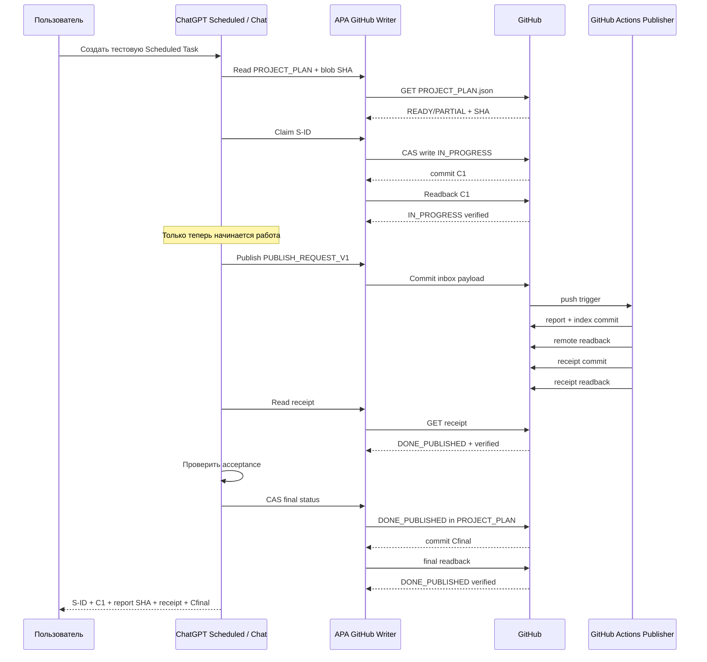

# APA Scheduled Task без Work/Codex: независимый аудит и схема внедрения

## Исполнительное резюме

На **10 октября 2026 года** задача APA в желаемом виде разбивается на три отдельных требования:

1. запускаться **каждый час**;
2. работать как обычная **ChatGPT Scheduled Task в Chat, а не Work/Codex**;
3. до начала работы надёжно писать `IN_PROGRESS` в `PROJECT_PLAN.json`, а после успешной публикации — `DONE_PUBLISHED`, Git commit и receipt.

Первые два требования реализуемы. OpenAI официально поддерживает повторяющиеся Scheduled Tasks до **одного запуска в час** на подходящих платных планах; обычные scheduled tasks работают в ChatGPT, тогда как **event-triggered/webhook tasks** работают именно в Work. Поэтому для APA нужен **time-scheduled task, а не GitHub event-triggered task**. citeturn1view0

Критический результат исследования: **третье требование нельзя выполнить через стандартное встроенное подключение GitHub в ChatGPT**. OpenAI прямо пишет, что штатное GitHub-приложение ChatGPT позволяет **только читать** репозитории; push/update/PR через него не поддерживаются, а для прямого редактирования OpenAI отсылает к Codex. citeturn8view0 Более общий документ OpenAI также говорит, что OpenAI-built apps сейчас search-only и для write/modify нужны custom MCP apps. citeturn8view2

Следовательно, существующий `CHATGPT_SCHEDULED_TASK.md` правильно требует:

> не начинать работу, пока `IN_PROGRESS` не записан и не прочитан обратно,

но его шаг `Проверь доступность GitHub connector для чтения и записи` **не может пройти при использовании только стандартного GitHub app**. Текущий файл сам помечен `NOT_CONFIGURED` и прямо требует проверить write-возможность в Scheduled execution. fileciteturn1file0L2-L2

Это совпадает с выводом ранее сохранённого аудита APA Research OS: GitHub должен быть постоянным источником состояния, а наличие Scheduled Task само по себе ещё не доказывает автоматическую публикацию. fileciteturn0file0

**Практический вывод:**

| Требование APA | Результат аудита |
|---|---|
| Scheduled каждый час | **ПОДТВЕРЖДЕНО** для подходящего платного плана |
| Не использовать Work | **ПОДТВЕРЖДЕНО**: создавать обычную time-based task в Chat |
| Не использовать Codex | **ПОДТВЕРЖДЕНО** для самого scheduler |
| Читать GitHub | **ПОДТВЕРЖДЕНО** |
| Писать GitHub стандартным GitHub app | **НЕВОЗМОЖНО** |
| `IN_PROGRESS` до исследования | **ВОЗМОЖНО только через отдельный write-channel** |
| `DONE_PUBLISHED` после проверки | **ВОЗМОЖНО только через отдельный write-channel** |
| GitHub Actions как publisher | **УЖЕ РЕАЛИЗОВАНО в APA** |
| Полностью unattended режим | **НЕ СЧИТАТЬ ГОТОВЫМ до E2E smoke test** |

В репозитории уже есть полноценный publisher: workflow запускается на canonical research branch, имеет `permissions: contents: write`, выполняет тесты controller/publisher, публикует immutable run, делает GitHub REST readback, создаёт receipt, повторно проверяет receipt и перестраивает `CONTROL_BOARD`/`HANDOFF`. Поэтому **переписывать publisher не надо**; отсутствующее звено — небольшой безопасный write-channel между обычной Scheduled Task и GitHub. fileciteturn4file0L2-L2

## Что реально поддерживает ChatGPT Scheduled

OpenAI разделяет обычные задачи по расписанию и event-triggered задачи. Обычная задача может быть одноразовой или повторяющейся; на подходящем платном плане период может доходить до **раза в час**. Event-triggered задачи, реагирующие, например, на GitHub PR, Gmail или Slack, запускаются в **Work**. Для APA поэтому следует выбирать именно расписание «каждый час», а не GitHub event trigger. citeturn1view0

Scheduled Tasks работают с eligible ChatGPT models, но OpenAI **не публикует фиксированный список моделей, доступных именно в Scheduled**: набор зависит от задачи, плана, workspace и rollout. Это важное ограничение — нельзя честно гарантировать из документации, что конкретно в твоём task editor сейчас будет виден GPT‑6 или GPT‑5.6 Sol. Это нужно проверить непосредственно в интерфейсе задачи. citeturn1view0

При этом обычный Chat и Work/Codex имеют разные usage pools. OpenAI прямо отделяет лимиты обычного Chat от Work/Codex; Work использует ту же структуру usage, что и Codex. citeturn1view1turn6view0 Поэтому операционный критерий для APA должен быть не «какое слово Sol стоит в названии backend-модели», а **в каком experience работает задача: Chat или Work**.

Это особенно важно из-за несколько запутанной текущей модели именования. В документации Work модели `GPT-6.1 Sol`, `GPT-6 Sol` и `GPT-6 Luna` указаны как Work/Codex model choices, тогда как документация обычного Chat одновременно сообщает, что пользовательский режим `GPT-6` в Chat внутри работает на GPT‑6 Sol. То есть название backend-модели само по себе не является надёжным индикатором расходования Work-квоты. citeturn1view1turn6view0

### Сравнение вариантов модели

| Вариант | Где используется | Scheduled | Расход Work/Codex allowance | Рекомендация APA |
|---|---|---:|---:|---|
| **Chat → GPT‑6, Medium** | обычный Chat | Eligibility зависит от аккаунта | **Не должен использовать Work/Codex pool**; точный accounting Scheduled отдельно не документирован | **Рекомендуемый кандидат** |
| **Chat → GPT‑5.6 Sol, Medium** | обычный Chat | Eligibility зависит от аккаунта | Chat/Thinking limits, а не Work/Codex | Хороший резерв |
| **Chat → GPT‑6 Pro** | обычный Chat на подходящем плане | Eligibility не опубликована | отдельный Chat Pro allowance | Не использовать каждый час без необходимости |
| **Work → GPT‑6.1 Sol** | Work/Codex | Да в Work при наличии доступа | **Да** | **Не использовать** |
| **Work → GPT‑6 Sol/Luna** | Work/Codex | Да в Work | **Да** | **Не использовать** |
| **Codex automation** | Codex | отдельная automation system | **Да, Codex** | **Не использовать** |
| **Deep Research** | Deep Research | не является нужным scheduler | отдельная Deep Research квота | **Не использовать автоматически** |

GPT‑6 сейчас разворачивается в обычном Chat на подходящих Plus, Pro, Business и Enterprise аккаунтах; GPT‑6 Pro имеет отдельные Chat-лимиты, а Work/Codex имеют отдельный allowance. citeturn6view0

**Самая безопасная настройка для твоей цели:** `Chat`, не `Work`; обычное **hourly schedule**, не event trigger; `GPT‑6 / Medium`, если модель действительно показывается в Scheduled editor. Если поле модели отсутствует или модель task не отображается после сохранения, значение модели нужно считать **UNSPECIFIED**, а не предполагать его.

Отдельно: Scheduled Tasks могут использовать connected apps, в том числе GitHub. Но действия, изменяющие внешние данные, могут требовать approval; если approval требуется, scheduled task приостанавливается до вмешательства пользователя. citeturn1view0turn8view1

## GitHub: права, запись и архитектурный блокер

### Стандартный GitHub connector

При штатном подключении:

`Settings → Apps → GitHub → Connect`

ChatGPT получает доступ только к выбранным репозиториям, а организация GitHub при необходимости должна одобрить приложение. Но стандартное приложение GitHub в ChatGPT **не умеет push/update**. Это не проблема недостающего OAuth scope, который можно просто поставить галочкой: write-action у этого встроенного приложения вообще не предоставляется. citeturn8view0

Поэтому текущая цепочка

```text
Scheduled Chat
→ built-in GitHub app
→ update PROJECT_PLAN.json
```

**неработоспособна по текущему продуктовому контракту OpenAI**.

### Что уже работает в APA

В `PROJECT_PLAN.json` уже закреплён необходимый инвариант:

```text
свежий PROJECT_PLAN.json
→ выбрать один READY/PARTIAL S-ID
→ CAS IN_PROGRESS
→ readback
→ только после этого работать
→ publish
→ verify
→ CAS DONE_PUBLISHED/PARTIAL/BLOCKED
→ второй readback
```

Сам `PROJECT_PLAN.json` объявлен единственным dispatch source и запрещает начинать работу до подтверждённого `IN_PROGRESS`. fileciteturn3file0L2-L2

Publisher тоже уже построен правильно. Он:

```text
push inbox / plan
       ↓
unit tests
       ↓
validate PROJECT_PLAN
       ↓
verify inbox
       ↓
prepare immutable run
       ↓
commit + push
       ↓
remote GitHub readback
       ↓
generate receipt
       ↓
commit receipt
       ↓
verify receipt
       ↓
rebuild CONTROL_BOARD/HANDOFF
       ↓
remote verification
```

Workflow уже запрашивает ровно `contents: write`, содержит concurrency group с `cancel-in-progress: false` и имеет timeout 15 минут. fileciteturn4file0L2-L2

В репозитории есть и доказанный пример receipt:

```json
{
  "indexed": true,
  "readback_verified": true,
  "report_commit_sha": "783a9f198a042343a4851ddc0eff91a993c70bcd",
  "report_path": "docs/research/apa-results/runs/2026-10-10/APA-RUN-20261010-104437Z-publisher-integration-smoke/REPORT.md",
  "status": "DONE_PUBLISHED"
}
```

То есть **publisher и структура receipt уже существуют и не являются теоретической конструкцией**. fileciteturn6file0L2-L2

### Какие GitHub permissions нужны writer-слою

Если писать через GitHub REST API, GitHub официально требует для `Create or update file contents`:

- classic OAuth token / classic PAT: `repo`;
- дополнительный `workflow` нужен только если writer должен изменять файлы внутри `.github/workflows`;
- fine-grained PAT или GitHub App: `Contents: write`;
- `Workflows: write` нужен только при изменении workflow-файлов;
- при обновлении существующего файла API требует его текущий blob `sha`. Устаревший/конфликтующий write возвращает `409`. citeturn7view0

Для APA writer **не должен редактировать `.github/workflows`**, поэтому минимальный GitHub App scope — фактически:

```text
Repository:
dvikt33-ux/safe-bim-layer

Repository permissions:
Contents: Read and write

Repository selection:
Only dvikt33-ux/safe-bim-layer
```

При этом в самом GitHub Actions publisher уже достаточно:

```yaml
permissions:
  contents: write
```

что в текущем workflow именно так и настроено. fileciteturn4file0L2-L2

Текущая canonical branch на момент проверки существует и **не защищена branch protection**, поэтому branch protection сейчас не является причиной блокировки write. fileciteturn5file0L2-L2

### Как получить write без Work/Codex

Есть два реалистичных класса решения.

**Для Business / Enterprise / Edu:** custom MCP app с write actions. OpenAI поддерживает full MCP с modify/write actions для Business и Enterprise/Edu; custom app можно использовать в обычных Chat conversations. Для OAuth OpenAI рекомендует refresh/offline access, иначе после истечения авторизации пользователь может быть вынужден повторно авторизоваться. citeturn8view2

Оптимальная custom app должна **не давать ChatGPT произвольный GitHub API**, а предоставить только узкие APA actions:

```text
apa_read_plan
apa_claim_task
apa_submit_publish_request
apa_finalize_task
apa_get_receipt
```

Внутри она уже делает GitHub CAS/write/readback.

Но есть существенная оговорка: официальная документация подтверждает write в обычных chats и поддержку apps в Scheduled Tasks в общем виде, однако **явно не гарантирует full-MCP write из unattended Scheduled execution**. Поэтому это статус:

`SUPPORTED_IN_CHAT / SCHEDULED_WRITE_UNSPECIFIED — MUST_SMOKE_TEST`. citeturn4search0turn8view2

**Для личного Plus/Pro:** full MCP write сейчас официально не предоставлен; Pro может использовать custom MCP с read/fetch, но full write MCP ограничен Business/Enterprise/Edu. Следовательно, на Plus/Pro нельзя честно обещать автономный GitHub writer через стандартные средства ChatGPT без Codex/Work. citeturn8view2

## Точная конфигурация задачи и текст инструкции

### Поля задачи

Создавать нужно **не в Work** и **не как GitHub event trigger**.

Рекомендуемые значения:

| Поле | Значение |
|---|---|
| Название | `APA — исполнитель единого плана` |
| Тип | Scheduled / time-based |
| Режим | `Chat` |
| Расписание | `Every hour / Каждый час` |
| Повтор | каждые `1 hour` |
| Часовой пояс | `Europe/Tallinn` |
| Завершение | `Never end / Без даты окончания` |
| Model | `GPT-6`, если доступен в task editor |
| Thinking | `Medium`, если доступно |
| Work | **НЕ ВЫБИРАТЬ** |
| GitHub event trigger | **НЕ ВЫБИРАТЬ** |
| Deep Research | **НЕ ВКЛЮЧАТЬ** |
| Codex | **НЕ ВКЛЮЧАТЬ** |
| Уведомления | Push + Email |
| Retry UI | **UNSPECIFIED** |
| Task timeout UI | **UNSPECIFIED** |

OpenAI подтверждает, что paid eligible plans допускают hourly scheduling; точный набор моделей зависит от аккаунта и workspace. Scheduled page также позволяет создавать, редактировать, приостанавливать и удалять задачи. citeturn1view0

### Действия в интерфейсе

Сначала открыть обычный **Chat**, а не Work. Проверить, что текущая беседа действительно отображается как Chat. Затем:

`Settings → Apps` и проверить GitHub. Если предполагается только built-in GitHub — остановиться: read есть, write нет. Если создан отдельный APA writer — проверить именно его connection и permissions. citeturn8view0turn8view2

После этого:

```text
Scheduled
→ Schedule a task / Создать задачу
→ вставить инструкцию
→ Custom repeat
→ Every 1 hour
→ Europe/Tallinn
→ Never end
→ Save
```

Если интерфейс предоставляет выбор режима, оставить **Chat**. Если предоставляет model picker, выбрать `GPT-6 / Medium`. Если режима/model picker нет, сохранить фактическое значение как `UNSPECIFIED` до первого запуска.

Если UI не предоставляет `Run now`, его наличие **не подтверждено официальной документацией**. Тогда безопасный способ smoke test — временно поставить первый одноразовый/ближайший запуск, проверить его и после успеха изменить schedule на hourly. OpenAI официально поддерживает как one-time, так и recurring tasks. citeturn1view0

### Точный текст из `CHATGPT_SCHEDULED_TASK.md`

Ниже — **без смысловых изменений** раздел «Инструкция для копирования в ChatGPT Scheduled» из текущей canonical branch:

```text
Ты — исполнитель одного шага APA по расписанию, а не самостоятельный планировщик исследований.

Репозиторий: `dvikt33-ux/safe-bim-layer`. Рабочая ветка **только** `research/apa-verified-results-hub-20261010`. Открой `docs/research/apa-results/control/PROJECT_PLAN.json`, `control/generated/HANDOFF.md`, `CONTROL_BOARD.md`, `TASK_CARDS.md` и `THEMES.md` из той же ветки. **Актуальный PROJECT_PLAN.json приоритетнее generated views.**

**ШАГ 0 — проверка доступа.** Проверь доступность GitHub connector для чтения и записи. Если в этом Scheduled запуске запись недоступна или требует неподтверждённого разрешения, остановись, сообщи `BLOCKED: GITHUB_WRITE_UNAVAILABLE`. Не исследуй ничего, пока стартовый статус не записан.

**ШАГ 1 — выбор.** Прочитай свежий PROJECT_PLAN.json и blob SHA. Выбери **один** `READY`/`PARTIAL` S-ID с наивысшим приоритетом, все `depends_on` которого `DONE_PUBLISHED`; учитывай `related`, `work_key`, `inputs`, существующие receipts и результаты. Не выбирай `IN_PROGRESS`, `CLAIMED`, `DONE_PUBLISHED`, `BLOCKED` или `SUPERSEDED`. Не начинай незарегистрированную тему. Если подходящих задач нет, остановись с `NO_ELIGIBLE_TASK`.

**ШАГ 2 — немедленно зафиксировать НАЧАЛО.** Сформируй уникальный `executor_run_id` для данного Scheduled запуска и идентификатор `owner`. Через GitHub `update_file` с **ожидаемым blob SHA** атомарно запиши для выбранного S-ID: `status=IN_PROGRESS`, `owner=<executor>`, `claim_ref=<executor_run_id>`, `lease_until=<UTC time с разумным запасом>`. Увеличь `revision` плана. **Прочитай файл обратно и убедись, что статус, owner и claim_ref действительно записаны.** До подтверждённой записи работу НЕ начинать. При конфликте SHA или занятой задаче перечитай план и попробуй другой доступный S-ID; чужой статус не перезаписывай.

**ШАГ 3 — выполнение.** Выполни только работу, описанную S-ID и `acceptance`. Не запускай Deep Research, платные API или Work/Codex за плату без отдельного разрешения. Не меняй `main/master`, PLN, APX, протестированные кодовые ветки и не делай merge. Если `requires_approval=true`, не совершай требующих разрешения действий без него. Сохраняй источники, технические ограничения, ревизии и результаты.

**ШАГ 4 — публикация и проверка.** Для research подготовь `PUBLISH_REQUEST_V1` с `substep_id`, `executor=owner` и `executor_run_id=claim_ref`, опубликуй в `docs/research/apa-results/inbox/`. Дождись GitHub Actions, убедись в наличии immutable report, успешном readback и `DONE_PUBLISHED` receipt. Для BUILD/CONTROL проверь code/docs commit, CI, GitHub readback и acceptance. **Квитанция об успешной публикации частичного отчёта сама по себе НЕ означает завершения задачи.**

**ШАГ 5 — зафиксировать РЕЗУЛЬТАТ.** Если acceptance полностью выполнен, CAS-запись `status=DONE_PUBLISHED` с доказательствами в `evidence`. Если сделана только часть — `status=PARTIAL` с ссылкой на опубликованный результат. Если блокировка — `status=BLOCKED` с `blocked_reason`. Очисти `owner`, `lease_until`, `claim_ref`; увеличь `revision`. Снова прочитай PROJECT_PLAN.json и проверь записанное состояние. Если запись результата не удалась, НЕ сообщай DONE: укажи `STATUS_WRITE_FAILED` и ссылку на сохранённые материалы.

**ШАГ 6 — краткий отчёт.** Сообщи S-ID, старый/новый статус, GitHub commit, receipt, оставшиеся зависимости и ссылку на актуальный CONTROL_BOARD. Не объявляй завершение без GitHub readback.

**Повторный запуск:** всегда начинай с шага 0 и свежего плана; не полагайся на историю текущего чата. Не освобождай чужие `IN_PROGRESS` по истечении lease автоматически — отмечай их для восстановления.
```

Это актуальный текст canonical файла. fileciteturn1file0L2-L2

**Но его нельзя считать рабочей конфигурацией только после вставки.** При стандартном GitHub app первый же шаг должен корректно закончиться `BLOCKED: GITHUB_WRITE_UNAVAILABLE`, потому что built-in GitHub integration read-only. citeturn8view0

После появления writer-канала я бы минимально изменил одну фразу:

```text
Проверь доступность утверждённого APA GitHub Writer для чтения,
CAS-записи и readback в canonical branch.
```

Это лучше, чем называть его generic `GitHub connector`, потому что стандартный connector write не имеет.

## Проверка `IN_PROGRESS` и `DONE_PUBLISHED`

Главный принцип здесь: **ответ ChatGPT не является доказательством состояния**.

Доказательством является GitHub.

### Как доказать `IN_PROGRESS`

Перед исследованием должно существовать:

```text
commit C1
PROJECT_PLAN.json
tasks[S-ID].status = IN_PROGRESS
tasks[S-ID].owner = <executor>
tasks[S-ID].claim_ref = <executor_run_id>
tasks[S-ID].lease_until != null
revision = previous_revision + 1
```

После write writer обязан заново получить `PROJECT_PLAN.json` **с GitHub**, а не использовать локальный результат операции, и сравнить все четыре поля.

Для update GitHub требует SHA заменяемого blob; если с момента чтения кто-то другой успел изменить файл, write должен завершиться конфликтом, а не молча затереть чужую работу. GitHub документирует обязательный `sha` для update и `409 Conflict` как штатный результат конфликта. citeturn7view0

Таким образом критерий:

```text
IN_PROGRESS_VERIFIED =
  write_commit_sha exists
  AND remote_readback.status == IN_PROGRESS
  AND remote_readback.owner == executor
  AND remote_readback.claim_ref == executor_run_id
  AND readback is from commit >= write_commit_sha
```

**До этого момента исследование не начинается.**

### Как доказать публикацию

Publisher уже умеет:

```text
REPORT
→ commit
→ GitHub remote verification
→ receipt
→ receipt commit
→ remote receipt verification
→ generated controller views
→ final remote verification
```

что видно прямо из workflow. fileciteturn4file0L2-L2

Receipt нужно считать валидным только если минимум:

```json
{
  "status": "DONE_PUBLISHED",
  "readback_verified": true,
  "indexed": true,
  "report_commit_sha": "...",
  "report_path": "...",
  "report_sha256": "..."
}
```

Существующий smoke receipt APA уже соответствует этой модели. fileciteturn6file0L2-L2

Но receipt означает:

```text
REPORT_PUBLISHED
```

а не автоматически:

```text
TASK_ACCEPTANCE_SATISFIED
```

Это различие уже правильно закреплено в `CHATGPT_SCHEDULED_TASK.md`. fileciteturn1file0L2-L2

Только после receipt Scheduled executor сравнивает результат с `acceptance`. Если acceptance полностью выполнен, создаётся отдельный final control commit:

```text
commit Cfinal

status = DONE_PUBLISHED
evidence += receipt/report/commit
owner = null
lease_until = null
claim_ref = null
revision += 1
```

а затем ещё один GitHub readback.

Итоговый инвариант:

```text
DONE_PUBLISHED =
  acceptance verified
  AND report receipt verified
  AND PROJECT_PLAN final commit exists
  AND final PROJECT_PLAN readback verified
```

### Временная последовательность smoke test



## Ошибки, тесты и мониторинг

### Отказы, которые надо считать штатными

**Нет write-tool.** Для встроенного GitHub app это ожидаемое состояние, а не временная ошибка. Правильное поведение: `BLOCKED: GITHUB_WRITE_UNAVAILABLE`, исследование не выполнять. citeturn8view0

**Approval prompt.** Scheduled Tasks могут остановиться, когда внешнее действие требует подтверждения. Это несовместимо с настоящей unattended 24/7 схемой до тех пор, пока конкретный write-action не доказан smoke test как выполняющийся без интерактивного approval. citeturn1view0turn8view1

**OAuth/token expired.** Для custom MCP OAuth OpenAI отдельно предупреждает: без refresh/offline access соединение может потерять авторизацию и потребовать повторной аутентификации. Поэтому writer OAuth должен поддерживать refresh token; для OIDC типичный scope — `offline_access` или provider-equivalent. citeturn8view2

**CAS conflict.** GitHub `409` означает, что исходный SHA уже не актуален. Нельзя повторять write с новым SHA поверх той же задачи вслепую. Нужно перечитать план; если задача уже `IN_PROGRESS`, выбрать другую или завершиться. citeturn7view0

**Validation failure / malformed request.** Contents API может вернуть `422`; это terminal failure для конкретной попытки, не повод циклически повторять request. citeturn7view0

**Scheduled task paused.** OpenAI сообщает, что задача может остановиться из-за required action, inactivity или удаления связанного чата; состояние нужно проверять в Scheduled. citeturn1view0

**Rate limit.** Для обычного authenticated GitHub REST пользователя типичный primary budget составляет тысячи запросов в час; GitHub Actions `GITHUB_TOKEN` имеет отдельный repository budget. Почасовая APA-задача сама по себе находится далеко ниже этих объёмов, однако клиент всё равно должен обрабатывать `x-ratelimit-*` и вторичные ограничения вместо бесконечных retries. citeturn7view2turn3search16

### Smoke test

Перед hourly режимом нужен **один отдельный тестовый S-ID**, зарегистрированный в `PROJECT_PLAN.json`; создавать «тест вне плана» противоречило бы собственной модели APA. Точный ID сейчас следует считать `UNSPECIFIED` до его внесения в plan.

Тест должен сделать только безопасную синтетическую работу:

```text
READY
  ↓
IN_PROGRESS commit
  ↓
readback
  ↓
маленький synthetic PUBLISH_REQUEST
  ↓
publisher workflow
  ↓
immutable synthetic report
  ↓
receipt readback
  ↓
acceptance
  ↓
DONE_PUBLISHED commit
  ↓
final readback
```

Pass-критерии:

| Проверка | PASS |
|---|---|
| Обычный Chat, не Work | task UI подтверждает Chat |
| Модель | зафиксирована в task UI или помечена `UNSPECIFIED` |
| `IN_PROGRESS` | отдельный Git commit существует |
| Порядок | `IN_PROGRESS` commit раньше report commit |
| Claim | `owner/claim_ref` совпадают с run |
| Publisher | GitHub Actions success |
| Report | существует на canonical branch |
| Readback | `readback_verified=true` |
| Receipt | `status=DONE_PUBLISHED` |
| Final plan | S-ID=`DONE_PUBLISHED` |
| Lease | очищен |
| Evidence | содержит report/receipt/commit |
| Work usage | Settings → Usage не показывает расход Work/Codex для теста |

Последняя проверка особенно важна. Документация ясно разделяет Chat и Work/Codex allowances, но **не даёт отдельной формулы биллинга для конкретного Scheduled execution**, поэтому отсутствие списания Work/Codex нужно проверить эмпирически через Usage dashboard после первого теста, а не предполагать. citeturn1view1turn6view0

### Failure simulation

Нужны ещё минимум три теста.

**Write unavailable:** временно отключить writer/app access. Ожидаемый результат — task останавливается до исследования и сообщает `GITHUB_WRITE_UNAVAILABLE`. Никакого report быть не должно.

**CAS conflict:** между read и update изменить `PROJECT_PLAN.json` другим контролируемым commit. Writer должен получить конфликт, перечитать план и **не перезаписать чужой state**. GitHub API предоставляет для этого именно SHA-based update semantics. citeturn7view0

**Publisher failure:** подать специально невалидный synthetic publish request, который controller должен отклонить. Ожидаемый результат: нет финального `DONE_PUBLISHED`; состояние становится `PARTIAL`, `BLOCKED` либо остаётся восстанавливаемым согласно protocol. В текущем publisher перед prepare уже выполняются controller validation и `verify-inbox`, поэтому такой fail-fast gate технически существует. fileciteturn4file0L2-L2

### Мониторинг

Минимально достаточно четырёх сигналов:

```text
Scheduled:
last_started_at
last_result

PROJECT_PLAN:
last revision / active claims

GitHub Actions:
publisher workflow success/failure

Receipts:
last DONE_PUBLISHED + readback_verified
```

Scheduled поддерживает Push/Email notifications. Их следует включить. citeturn1view0

В GitHub можно вести generated heartbeat, например:

```json
{
  "scheduler": "chatgpt-scheduled",
  "last_trigger_at": "...",
  "last_executor_run_id": "...",
  "last_claim_commit": "...",
  "last_done_commit": "...",
  "last_receipt": "...",
  "state": "OK"
}
```

При этом GitHub Actions может выполнять **только watchdog/validation**, не выбирать темы и не запускать исследования: это сохраняет уже установленный принцип APA, что источником dispatch является `PROJECT_PLAN.json`, а trigger — ChatGPT Scheduled. Эта политика уже записана в текущем plan. fileciteturn3file0L2-L2

## Рекомендуемая конфигурация и чек-лист

### Рекомендуемая безопасная конфигурация

Моя итоговая рекомендация:

```text
TRIGGER
ChatGPT Scheduled Task
time-based: every 1 hour
timezone: Europe/Tallinn
experience: Chat
NOT Work
NOT Codex
NOT Deep Research

MODEL
GPT-6 / Medium, если доступен
иначе обычная доступная Chat model
и модель помечается UNSPECIFIED до UI-verification

CONTROL
PROJECT_PLAN.json
единственный dispatch source

WRITE
не built-in GitHub app
а отдельный минимальный APA GitHub Writer

WRITER PERMISSIONS
repository: dvikt33-ux/safe-bim-layer only
Contents: write
без Workflows write
без Issues/PR/Admin
canonical branch only на уровне логики writer

CLAIM
SHA/CAS
1 controlled retry максимум
readback mandatory

LEASE
разумный запас > ожидаемого времени одного run
точная длительность: UNSPECIFIED
не освобождать чужой expired lease автоматически

PUBLISH
существующий GitHub Actions publisher
timeout: 15 min уже настроен
concurrency: cancel-in-progress=false уже настроено

RETRY
409 → re-read plan → другой eligible S-ID или stop
OAuth/approval → BLOCKED, без исследования
publisher fail → не писать DONE
следующий hourly tick выполняет recovery

DONE
receipt verified
+
acceptance verified
+
final PROJECT_PLAN commit
+
final GitHub readback
```

Текущий GitHub publisher уже соответствует большей части этой схемы. fileciteturn4file0L2-L2

### Для Business / Enterprise / Edu

Наиболее чистый путь без Work/Codex:

```text
Scheduled Chat
       ↓
custom APA MCP Writer
       ↓
GitHub REST
       ↓
canonical branch
       ↓
existing GitHub Actions publisher
```

Full MCP write официально поддерживается именно для Business/Enterprise/Edu. Но compatibility write-capable custom app с unattended Scheduled execution надо считать отдельным **P40 gate**, пока реальный запуск это не подтвердил. citeturn8view2

### Для Plus / Pro

При использовании только официального built-in GitHub app:

```text
Scheduled Chat
       ↓
GitHub read
       ↓
STOP
```

Потому что direct GitHub write отсутствует. citeturn8view0

Поэтому конфигурацию **«Plus/Pro + обычный Scheduled Chat + built-in GitHub + полностью автономные IN_PROGRESS/DONE commits»** на текущих официальных возможностях нельзя обозначать как рабочую.

### Итоговый implementation checklist

| Gate | Что должно быть подтверждено | Статус сейчас |
|---|---|---|
| Scheduler доступен | `Scheduled` виден в аккаунте | **ACCOUNT-SPECIFIC** |
| Hourly доступен | `Every 1 hour` можно сохранить | **SUPPORTED ON ELIGIBLE PAID PLAN** |
| Mode | task работает в `Chat`, не `Work` | **НУЖНО ПРОВЕРИТЬ В UI** |
| Model | GPT‑6/другая regular Chat model | **ACCOUNT-SPECIFIC** |
| GitHub read | `PROJECT_PLAN.json` читается | **ПОДТВЕРЖДЕНО В ТЕКУЩЕМ КОНТЕКСТЕ** |
| Standard GitHub write | built-in app пишет файлы | **НЕ ПОДДЕРЖИВАЕТСЯ** |
| APA writer | отдельный write action существует | **НЕ ПОДТВЕРЖДЕНО** |
| Writer permission | `Contents: write`, один repo | **ТРЕБУЕТ НАСТРОЙКИ** |
| OAuth persistence | refresh/offline auth работает | **ТРЕБУЕТ ТЕСТА** |
| IN_PROGRESS CAS | commit + remote readback до работы | **ТРЕБУЕТ E2E TEST** |
| Publisher | Actions создаёт report/receipt/readback | **УЖЕ РЕАЛИЗОВАНО И ЕСТЬ SMOKE RECEIPT** |
| Final status | plan `DONE_PUBLISHED` после acceptance | **ТРЕБУЕТ E2E TEST** |
| Work usage | тест не уменьшает Work/Codex pool | **ПРОВЕРИТЬ SETTINGS → USAGE** |
| Failure test | no-write / CAS / publisher fail | **НЕ ПРОВЕДЕНО** |
| Hourly production | включить только после всех gates | **ПОКА НЕ ВКЛЮЧАТЬ КАК VERIFIED 24/7** |

Самое важное изменение относительно прежнего подхода: **не нужно снова исследовать, как заставить стандартный GitHub connector писать — официально он этого не делает**. citeturn8view0 Нужно сохранить существующий controller и существующий GitHub Actions publisher, а между обычной Chat Scheduled Task и GitHub добавить **один узкий write-capable APA Publisher/Writer endpoint**. После этого один smoke run должен доказать всю цепочку:

```text
SCHEDULED CHAT
      ↓
IN_PROGRESS COMMIT
      ↓
REMOTE READBACK
      ↓
ONE S-ID EXECUTED
      ↓
PUBLISH_REQUEST
      ↓
GITHUB ACTIONS
      ↓
REPORT COMMIT
      ↓
REMOTE READBACK
      ↓
RECEIPT
      ↓
ACCEPTANCE
      ↓
DONE_PUBLISHED COMMIT
      ↓
FINAL READBACK
```

Только после этого `PROJECT_PLAN.json.scheduler.state` следует переводить из текущего `NOT_CONFIGURED`/`CONFIGURED_UNVERIFIED` в фактически подтверждённый рабочий статус. Текущая инструкция сама предписывает не считать scheduler работающим до реального end-to-end запуска. fileciteturn1file0L2-L2